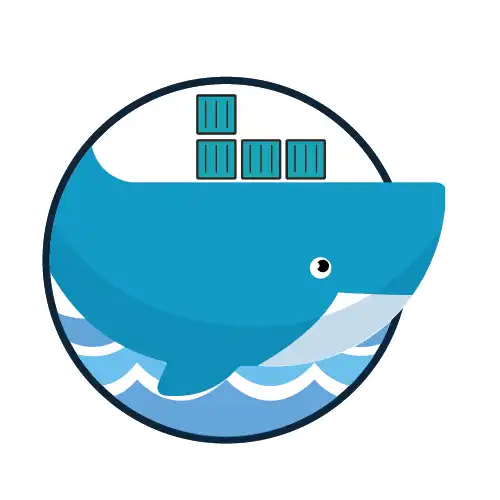

<div align="center">
   
</div>

# Desmistificando o Docker

Treinamento de introdução ao Docker

## Armazenamento de Dados

## Processamento, logs e Rede

## Definição e criação de um Dockerfile

Para criar uma imagem personalizada do Docker, basta criar um Dockerfile com todas as definições necessárias. 

Veja abaixo um exemplo de docker file que copia um arquivo `app.py` e o executa assim que um container for lançado utilizando a imagem gerada.

```dockerfile
FROM ubuntu

RUN apt update && apt install -y python3 && apt clean

COPY app.py /opt/app.py

CMD python3 /opt/app.py
```

Após definido o Dockerfile, basta executar o comando `docker build` para gerar a imagem. 
```
docker build -t ubuntu-python:1.0 .
```

### Exemplo de Dockerfile para criação de imagem personalizada do Apache
  
```dockerfile
FROM debian

RUN apt-get update && apt-get install apache2 -y && apt-get clean

ADD site.tar.gz /var/www/html

LABEL description = "Apache webserver 1.0"

VOLUME /var/www/html

EXPOSE 80

ENTRYPOINT ["/usr/sbin/apachectl"]

CMD ["-D", "FOREGROUND"]
```

### Exemplo de Dockerfile para criação de imagem personalizada do Python 
  
```dockerfile
FROM python:3

WORKDIR /usr/src/app

COPY app.py /usr/src/app

CMD [ "python", "./app.py" ]
```

### Gerando uma imagem MULTISTAGE

É possível definir arquivos Dockerfiles utilizando a técnica de multistage build, que permite que uma imagem seja gerada copiando arquivos de uma estágio de build anterior. Uma das vantagens dessa técnica é que a imagem final não precisa conter todas as dependências necessárias para o build, apenas as necessárias para a execução do software, fazendo com que a imagem final seja menor.

Veja abaixo um exemplo de Dockerfile que utiliza a técnica de multistage build para gerar uma imagem final com apenas *11MB*, enquanto a imagem utilizada na fase de build possui *992MB*.

```dockerfile
FROM golang as golang-builder

COPY app.go /go/src/app/

ENV GO111MODULE=auto

WORKDIR /go/src/app

RUN go build -o app.go .

FROM alpine

WORKDIR /appexec
COPY --from=golang-builder /go/src/app/ /appexec
RUN chmod -R 755 /appexec
ENTRYPOINT ./app.go
```

Para gerar a imagem , basta realizar o build normalmente.

```
docker build -t golang-app:1.0 .
```

### Realizando o upload de imagens para o Docker Hub

Para realizar o upload de uma imagem para o Docker Hub, basta realizar o login no Docker Hub, fazer o build da imagem com uma tag seguindo o padrão "username/imagename" e em seguida realizar o push da imagem.

```
docker login
docker build -t myuser/myimage:1.0 .
docker push myuser/myimage:1.0
```

### Criando um Registry Privado

Para criar um registry privado, basta executar o comando abaixo, que irá criar um container com o registry privado.

```
docker run -d -p 5000:5000 --restart=always --name registry registry:2
````

Após a criação do registry privado, basta realizar o login no registry privado, fazer o build da imagem com uma tag seguindo o padrão "registryserver:5000/imagename" e em seguida realizar o push da imagem.

```
docker login registryserver:5000
docker build -t registryserver:5000/myimage:1.0 .
docker push registryserver:5000/myimage:1.0
```

Caso o registry privado não rode utilizando um certificado SSL, é necessário adicionar a flag `--insecure-registry` no arquivo `/etc/docker/daemon.json` para que o docker consiga realizar o push das imagens.

```json
{
  "insecure-registries" : ["registryserver:5000"]
}
```

Se necessário verificar as imagens disponíveis no registry privado, basta acessar a url http://registryserver:5000/v2/_catalog.

````
curl http://registryserver:5000/v2/_catalog
````