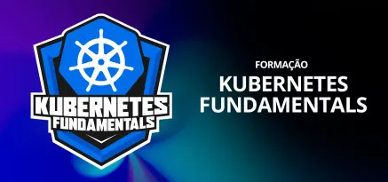

<div align="center">
   
</div>

# CI-CD com Kubernetes

## O que é CI/CD?
CI/CD (Integração Contínua e Entrega Contínua) é uma prática de desenvolvimento de software que visa automatizar o processo de integração e entrega de código. O objetivo é permitir que os desenvolvedores integrem suas alterações de código em um repositório compartilhado com frequência, garantindo que o código esteja sempre em um estado funcional.
A CI/CD é composta por duas partes principais:
- **Integração Contínua (CI)**: Refere-se ao processo de integrar o código de diferentes desenvolvedores em um repositório compartilhado. Isso envolve a execução de testes automatizados para garantir que o código esteja funcionando corretamente e não quebre a aplicação.
- **Entrega Contínua (CD)**: Refere-se ao processo de entregar o código integrado em um ambiente de produção. Isso envolve a automação do processo de implantação, garantindo que o código esteja sempre pronto para ser implantado em produção.

## O que é um Pipeline?
Um pipeline é uma série de etapas que automatizam o processo de CI/CD. Cada etapa do pipeline executa uma tarefa específica, como compilar o código, executar testes, criar imagens de contêiner e implantar o código em um ambiente de produção. Os pipelines podem ser configurados para serem executados automaticamente sempre que houver uma alteração no código, garantindo que o código esteja sempre em um estado funcional e pronto para ser implantado.

## O que é um Deploy?
Um deploy é o processo de implantar uma aplicação em um ambiente de produção. Isso envolve a transferência do código da aplicação para o ambiente de produção, onde ele pode ser acessado pelos usuários finais. O deploy pode ser feito manualmente ou automaticamente, dependendo da configuração do pipeline de CI/CD.

## O que é um Ambiente?
Um ambiente é um espaço isolado onde uma aplicação é executada. Os ambientes podem ser usados para desenvolvimento, teste e produção. Cada ambiente pode ter configurações diferentes, como variáveis de ambiente, serviços e recursos, dependendo das necessidades da aplicação.

## Criando um Pipeline com Gitlab CI/CD
O GitLab CI/CD é uma ferramenta de integração contínua e entrega contínua que permite automatizar o processo de desenvolvimento e implantação de aplicações. O GitLab CI/CD usa arquivos `.gitlab-ci.yml` para definir os pipelines, que são executados sempre que há uma alteração no código.
O arquivo `.gitlab-ci.yml` contém as etapas do pipeline, as imagens de contêiner a serem usadas e as variáveis de ambiente necessárias para a execução do pipeline. 

Aqui está um exemplo de um arquivo `.gitlab-ci.yml`:
```yaml
stages:
  - build
  - test
  - deploy
variables:
  IMAGE_NAME: my-image
  IMAGE_TAG: latest
  KUBE_CONTEXT: my-kube-context
build:
  stage: build
  image: docker:latest
  services:
    - docker:dind
  script:
    - docker build -t $IMAGE_NAME:$IMAGE_TAG .
    - docker push $IMAGE_NAME:$IMAGE_TAG
test:
  stage: test
  image: docker:latest
  script:
    - docker run $IMAGE_NAME:$IMAGE_TAG ./run-tests.sh
deploy:
  stage: deploy
  image: bitnami/kubectl:latest
  script:
    - kubectl config use-context $KUBE_CONTEXT
    - kubectl apply -f deployment.yaml
``` 