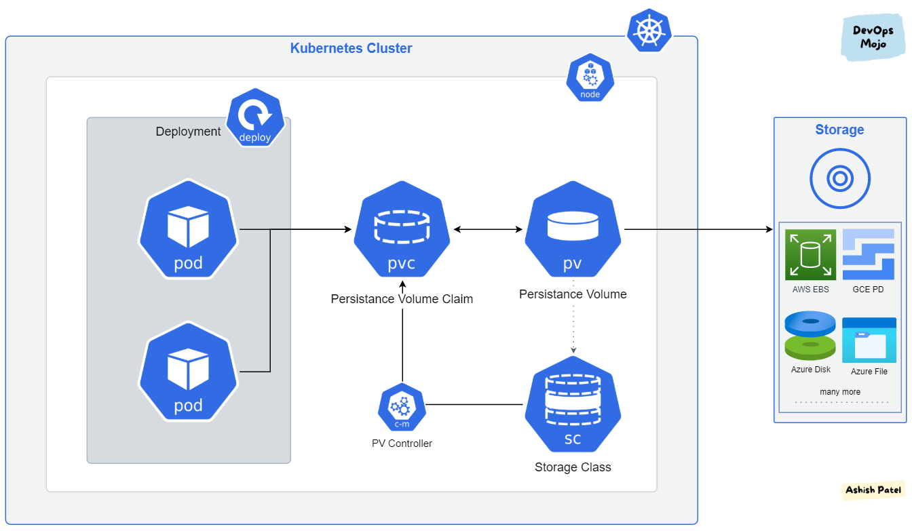

<div align="center">
   
</div>

# Introdução ao PV e PVC

## O que são PV e PVC?

PV (Persistent Volume) e PVC (Persistent Volume Claim) são recursos do Kubernetes que permitem a persistência de dados em um cluster. Eles são usados para gerenciar o armazenamento de forma abstrata, permitindo que os desenvolvedores se concentrem na aplicação em vez de se preocupar com a infraestrutura de armazenamento subjacente.

O PV é um recurso de armazenamento que é provisionado por um administrador do cluster. Ele representa uma unidade de armazenamento física ou lógica que pode ser usada por pods em execução no cluster. O PV pode ser provisionado de várias maneiras, como usando NFS, iSCSI, EBS (Elastic Block Store) da AWS, entre outros.

O PVC, por outro lado, é um pedido de armazenamento feito por um usuário. Ele solicita uma quantidade específica de armazenamento e pode especificar requisitos adicionais, como o tipo de armazenamento (por exemplo, SSD ou HDD). O Kubernetes irá automaticamente vincular o PVC a um PV disponível que atenda aos requisitos solicitados.
Isso permite que os desenvolvedores solicitem armazenamento de forma dinâmica, sem precisar se preocupar com a configuração do armazenamento subjacente.

Fonte: [Kubernetes Documentation](https://kubernetes.io/docs/concepts/storage/persistent-volumes/)


Imagem retirada do endereço: [Exploring the Depths of Kubernetes Pods: An In-Depth Analysis🌟
](https://www.linkedin.com/pulse/exploring-depths-kubernetes-pods-in-depth-analysis-subho-dey/)

## Criando um PV e PVC
Para criar um PV, você pode usar os seguintes arquivos YAML como exemplo:
```yaml
# pv.yaml
apiVersion: v1
kind: PersistentVolume
metadata:
  name: local-pv
  labels:
    type: local
spec:
  storageClassName: manual
  capacity:
    storage: 2Gi
  accessModes:
    - ReadWriteOnce
  hostPath: 
    path: /mnt/data
```

Para criar um PVC, você pode usar os seguintes arquivos YAML como exemplo:
```yaml
# pvc.yaml
apiVersion: v1
kind: PersistentVolumeClaim
metadata:
  name: local-pvc
spec:
  accessModes:
    - ReadWriteOnce
  resources:
    requests:
      storage: 1Gi
  storageClassName: manual
```
## Atribuindo um deployment a um PVC
Para atribuir um deployment a um PVC, você pode usar os seguintes arquivos YAML como exemplo:
```yaml
# deployment.yaml
apiVersion: apps/v1
kind: Deployment
metadata:
  name: my-deployment
spec:
  replicas: 1
  selector:
    matchLabels:
      app: my-app
  template:
    metadata:
      labels:
        app: my-app
    spec:
      containers:
        - name: my-container
          image: nginx
          volumeMounts:
            - mountPath: /usr/share/nginx/html
              name: my-pvc
      volumes:
        - name: my-pvc
          persistentVolumeClaim:
            claimName: local-pvc
```

## Provisionar um PVC dinamicamente no GCP

O Google Cloud Platform (GCP) oferece suporte a provisionamento dinâmico de volumes persistentes usando o Google Compute Engine Persistent Disk. Para usar o provisionamento dinâmico, você deve criar uma StorageClass que define o tipo de disco e as opções de provisionamento.
A StorageClass é um recurso do Kubernetes que define as características de um volume persistente, como o tipo de disco, a zona e outras opções de provisionamento. O GCP oferece várias StorageClasses pré-definidas, como `standard`, `standard-rwo`, `pd-ssd`, entre outras.
A StorageClass `standard` é usada para criar discos persistentes padrão, enquanto a `pd-ssd` é usada para criar discos SSD. Você pode escolher a StorageClass apropriada com base nas necessidades de desempenho e custo do seu aplicativo.
Para criar uma StorageClass no GCP, você pode usar o seguinte arquivo YAML como exemplo:
```yaml
# storage-class.yaml
apiVersion: storage.k8s.io/v1
kind: StorageClass
metadata:
  name: standard-rwo
provisioner: pd.csi.storage.gke.io
parameters:
  type: pd-standard
  replication-type: none
  zones: us-central1-a
reclaimPolicy: Delete
volumeBindingMode: WaitForFirstConsumer
```

### Criando um PVC com a StorageClass do GCP

Para criar um PVC que usa a StorageClass do GCP, você pode usar o seguinte arquivo YAML como exemplo:
```yaml
# pvc-gcp.yaml
apiVersion: v1
kind: PersistentVolumeClaim
metadata:
  name: gcp-pvc
spec:
  accessModes:
    - ReadWriteOnce
  resources:
    requests:
      storage: 5Gi
  storageClassName: standard-rwo
```
O PVC `gcp-pvc` solicitará um volume persistente de 5 GiB usando a StorageClass `standard-rwo`. O provisionamento dinâmico criará automaticamente um disco persistente no GCP com as características definidas na StorageClass.


### Criando um deployment com o PVC do GCP
Para criar um deployment com o PVC do GCP, você pode usar os seguintes arquivos YAML como exemplo:
```yaml
# deployment-gcp.yaml
apiVersion: apps/v1
kind: Deployment
metadata:
  name: gcp-deployment
spec:
  replicas: 2
  selector:
    matchLabels:
      app: gcp-app-example
  template:
    metadata:
      labels:
        app: gcp-app-example
    spec:
      containers:
        - name: gcp-container
          image: nginx
          volumeMounts:
            - mountPath: /usr/share/nginx/html
              name: gcp-pvc
      volumes:
        - name: gcp-pvc
          persistentVolumeClaim:
            claimName: gcp-pvc
```

## Utilizando um servidor NFS como PV
O NFS (Network File System) é um protocolo de compartilhamento de arquivos que permite que sistemas diferentes acessem arquivos em um servidor remoto como se fossem locais. O Kubernetes pode usar o NFS como um tipo de armazenamento persistente, permitindo que vários pods acessem o mesmo volume simultaneamente.
Para usar o NFS como um PV no Kubernetes, você precisa ter um servidor NFS configurado e acessível a partir do cluster Kubernetes. O servidor NFS deve exportar um diretório que será montado pelos pods.

Podemos utilizar um servidor NFS local ou um servidor NFS em nuvem, como o Amazon EFS (Elastic File System) ou o Google Cloud Filestore. O processo de configuração é semelhante, mas os detalhes de configuração podem variar dependendo do provedor de nuvem.


Para criar um PV usando o NFS, você pode usar o seguinte arquivo YAML como exemplo:
```yaml
# pv-nfs.yaml
apiVersion: v1
kind: PersistentVolume
metadata:
  name: nfs-pv
spec:
  capacity:
    storage: 10Gi
  accessModes:
    - ReadWriteMany
  nfs:
    path: /path/to/nfs/share
    server: nfs-server.example.com
  persistentVolumeReclaimPolicy: Retain
```

Para criar um PVC que usa o PV NFS, você pode usar o seguinte arquivo YAML como exemplo:
```yaml
# pvc-nfs.yaml
apiVersion: v1
kind: PersistentVolumeClaim
metadata:
  name: nfs-pvc
spec:
  accessModes:
    - ReadWriteMany
  storageClassName: ""
  volumeName: nfs-pv
  resources:
    requests:
      storage: 5Gi
```

### Criando um deployment com o PVC NFS
Para criar um deployment de um servidor web que usa o PVC NFS, você pode usar o seguinte arquivo YAML como exemplo:
```yaml
# deployment-nfs.yaml
apiVersion: apps/v1
kind: Deployment
metadata:
  name: nfs-deployment
spec:
  replicas: 4
  selector:
    matchLabels:
      app: nfs-app-example
  template:
    metadata:
      labels:
        app: nfs-app-example
    spec:
      containers:
        - name: nfs-container
          image: nginx
          volumeMounts:
            - mountPath: /usr/share/nginx/html
              name: nfs-pvc
      volumes:
        - name: nfs-pvc
          persistentVolumeClaim:
            claimName: nfs-pvc
```

## Resumo

- PV (Persistent Volume) e PVC (Persistent Volume Claim) são recursos do Kubernetes que permitem a persistência de dados em um cluster.
- O PV é um recurso de armazenamento provisionado por um administrador do cluster, enquanto o PVC é um pedido de armazenamento feito por um usuário.
- O Kubernetes vincula automaticamente o PVC a um PV disponível que atenda aos requisitos solicitados.
- O Google Cloud Platform (GCP) oferece suporte a provisionamento dinâmico de volumes persistentes usando o Google Compute Engine Persistent Disk.
- O NFS (Network File System) é um protocolo de compartilhamento de arquivos que permite que sistemas diferentes acessem arquivos em um servidor remoto como se fossem locais.
- O Kubernetes pode usar o NFS como um tipo de armazenamento persistente, permitindo que vários pods acessem o mesmo volume simultaneamente.
- Para usar o NFS como um PV no Kubernetes, você precisa ter um servidor NFS configurado e acessível a partir do cluster Kubernetes.
- O servidor NFS deve exportar um diretório que será montado pelos pods.