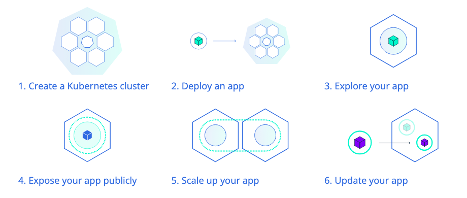

<div align="center">
   
</div>

# Kubernetes do Zero a Produção

Kubernetes é uma das tecnologias mais utilizadas no momento e pessoas com habilidades em Kubernetes estão sendo muito requisitadas pelo mercado de tecnologia da informação. Em um mundo onde aplicações estão migrando de arquiteturas monolíticas para microsserviços, o entendimento de como os microsserviços devem ser publicados e principalmente escalados é de vital importância para desenvolvedores e demais profissionais envolvidos em um projeto.


Durante este curso, você trabalhará com projetos reais e aprenderá as formas de publicar aplicações em um cluster Kubernetes na nuvem ou em um ambiente local de treinamento. Projetos de deploy de aplicações e os conceitos de DevOps de CI/CD estão contemplados na trilha.

⚠️ Pré-requisitos: Conhecimentos básicos em [Lógica de Programação](https://web.dio.me/course/logica-de-programacao-essencial/learning/aea1ea26-fd56-417d-8272-6e15253f4405), [Pensamento Computacional](https://web.dio.me/course/pensamento-computacional/learning/050675c1-8a7f-476b-a778-9b1c7eb75744?autoplay=1) e [Formação Linux Fundamentals](https://web.dio.me/track/formacao-linux-fundamentals)

✅ Desejáveis: [Formação Docker Fundamentals](https://web.dio.me/track/formacao-docker-fundamentals)

## Introdução ao Kubernetes

### Introdução a Kubernetes e Orquestração de Containers

O Kubernetes (k8s) é uma ferramenta de orquestração de containers que automatiza a implantação, o dimensionamento e a operação de aplicativos em contêineres. Ele foi originalmente desenvolvido pelo Google e agora é mantido pela Cloud Native Computing Foundation (CNCF). O Kubernetes é projetado para facilitar a gestão de aplicações em contêineres em ambientes de produção, oferecendo recursos como balanceamento de carga, escalabilidade automática, recuperação automática e gerenciamento de configuração.

O Kubernetes é amplamente utilizado em ambientes de nuvem, mas também pode ser executado em servidores locais. Ele é compatível com várias plataformas de contêiner, incluindo Docker, e pode ser integrado a outras ferramentas e serviços de nuvem.

#### Qual a necessidade de uma ferramenta de orquestração?

A necessidade de uma ferramenta de orquestração surge da complexidade envolvida na gestão de aplicações em contêineres. À medida que as aplicações se tornam mais distribuídas e compostas por vários serviços, a orquestração se torna essencial para garantir que todos os componentes funcionem juntos de maneira eficiente e confiável.
A orquestração de contêineres permite que os desenvolvedores e operadores automatizem tarefas como:
- Implantação de aplicações
- Escalabilidade
- Monitoramento
- Recuperação de falhas
- Gerenciamento de configuração
- Balanceamento de carga
- Atualizações contínuas

####  Tutorial básico de Kubernetes

Saindo um pouco do conteúdo do curso, mas ainda assim muito interessante, o site oficial do Kubernetes possui uma série de tutoriais e guias que podem ajudar tanto iniciantes quanto profissionais experientes a aprender mais sobre a ferramenta e suas funcionalidades. Esses tutoriais abrangem desde conceitos básicos até tópicos avançados, como segurança, rede e armazenamento.

Dentre os tutoriais, está disponível um básico de Kubernetes, nomeado como Kubernetes Basics, que pode ser acessado através do seguinte link: [Kubernetes Basics](https://kubernetes.io/docs/tutorials/kubernetes-basics/). O tutorial é interessante e está dividido em 6 partes como você pode ver na imagem abaixo:



Fonte: [Kubernetes Basics](https://kubernetes.io/docs/tutorials/kubernetes-basics/)

#### Arquitetura básica do Kubernetes

#### Pods Overview

Os pods são a menor unidade de execução no Kubernetes. Eles podem conter um ou mais contêineres que compartilham o mesmo namespace de rede e armazenamento. Os pods são programados nos nós de trabalho pelo scheduler e podem ser escalados conforme necessário.


#### Cluster Kubernetes

Um cluster Kubernetes é um conjunto de máquinas (físicas ou virtuais) que executam aplicações em contêineres. O cluster é composto por dois tipos principais de nós: o nó mestre (control plane) e os nós de trabalho (worker nodes). O nó mestre é responsável por gerenciar o cluster, enquanto os nós de trabalho executam as aplicações.


#### Nó mestre (Control Plane)

O nó mestre é o cérebro do cluster Kubernetes. Ele é responsável por gerenciar o estado do cluster, incluindo a programação de contêineres, a manutenção do estado desejado e a implementação de atualizações. O nó mestre contém os seguintes componentes principais:
- **API Server**: O ponto de entrada para todas as operações do Kubernetes. Ele expõe a API do Kubernetes e é responsável por processar solicitações de clientes e interagir com os outros componentes do cluster.
- **Scheduler**: O componente responsável por programar os pods (unidades de execução do Kubernetes) nos nós de trabalho. Ele analisa as solicitações de recursos e decide onde implantar os pods com base na disponibilidade de recursos e nas políticas definidas.
- **Controller Manager**: O componente responsável por monitorar o estado do cluster e garantir que ele corresponda ao estado desejado. Ele executa controladores que gerenciam diferentes aspectos do cluster, como replicação de pods, balanceamento de carga e gerenciamento de nós.
- **etcd**: Um banco de dados chave-valor distribuído que armazena todas as informações de configuração e estado do cluster. O etcd é usado para armazenar dados persistentes e garantir a consistência do estado do cluster.
- **Cloud Controller Manager**: Um componente opcional que permite que o Kubernetes interaja com provedores de nuvem. Ele gerencia recursos específicos da nuvem, como balanceadores de carga e armazenamento em nuvem.

#### Nós de trabalho (Worker Nodes)
Os nós de trabalho são as máquinas que executam as aplicações em contêineres. Cada nó de trabalho contém os seguintes componentes principais:
- **Kubelet**: Um agente que se comunica com o nó mestre e garante que os contêineres estejam em execução conforme especificado. O Kubelet monitora o estado dos pods e relata informações de volta ao nó mestre.
- **Kube Proxy**: Um componente responsável por gerenciar o tráfego de rede entre os pods e o mundo externo. Ele implementa regras de rede e balanceamento de carga para garantir que as solicitações sejam encaminhadas corretamente.
- **Container Runtime**: O software responsável por executar os contêineres. O Kubernetes é compatível com várias runtimes de contêiner, incluindo Docker, containerd e CRI-O.
- **Pods**: A menor unidade de execução no Kubernetes. Um pod pode conter um ou mais contêineres que compartilham o mesmo namespace de rede e armazenamento. Os pods são programados nos nós de trabalho pelo scheduler e podem ser escalados conforme necessário.
- **Namespaces**: Uma forma de dividir os recursos do cluster em ambientes isolados. Os namespaces permitem que diferentes equipes ou projetos compartilhem o mesmo cluster sem interferir uns nos outros.
- **Volumes**: Uma abstração de armazenamento que permite que os contêineres compartilhem dados e persistam informações entre reinicializações. Os volumes podem ser montados em pods e usados para armazenar dados temporários ou permanentes.
- **ConfigMaps e Secrets**: Recursos que permitem armazenar dados de configuração e informações sensíveis, como senhas e chaves de API, de forma segura. Os ConfigMaps e Secrets podem ser montados em pods como variáveis de ambiente ou volumes.
- **Labels e Annotations**: Metadados que podem ser aplicados a pods e outros recursos do Kubernetes. As labels são usadas para organizar e selecionar recursos, enquanto as annotations são usadas para armazenar informações adicionais sobre os recursos.
- **Deployments**: Um recurso que gerencia a implantação e o escalonamento de pods. Os deployments permitem que os desenvolvedores especifiquem o estado desejado dos pods e o Kubernetes se encarrega de garantir que esse estado seja alcançado.
- **ReplicaSets**: Um recurso que garante que um número específico de réplicas de um pod esteja em execução em um cluster. Os ReplicaSets são usados para garantir a alta disponibilidade e a escalabilidade das aplicações.
- **Services**: Um recurso que fornece uma maneira de expor os pods para o mundo externo. Os serviços permitem que os pods se comuniquem entre si e com o mundo externo, independentemente de onde estão localizados no cluster.
- **Ingress**: Um recurso que fornece uma maneira de gerenciar o acesso externo aos serviços do Kubernetes. O Ingress permite definir regras de roteamento e balanceamento de carga para expor os serviços de forma segura.
- **Network Policies**: Um recurso que permite definir regras de rede para controlar o tráfego entre os pods. As Network Policies permitem que os desenvolvedores especifiquem quais pods podem se comunicar entre si e com o mundo externo.
- **Horizontal Pod Autoscaler**: Um recurso que ajusta automaticamente o número de réplicas de um pod com base na carga de trabalho. O Horizontal Pod Autoscaler monitora métricas como uso de CPU e memória e ajusta o número de réplicas conforme necessário.
- **Vertical Pod Autoscaler**: Um recurso que ajusta automaticamente os recursos (CPU e memória) alocados para um pod com base na carga de trabalho. O Vertical Pod Autoscaler monitora o uso de recursos e ajusta as solicitações e limites de recursos dos pods conforme necessário.
- **StatefulSets**: Um recurso que gerencia a implantação e o escalonamento de pods com estado. Os StatefulSets são usados para aplicações que requerem armazenamento persistente e identificação única, como bancos de dados.
- **DaemonSets**: Um recurso que garante que um pod seja executado em todos os nós de trabalho ou em um subconjunto específico de nós. Os DaemonSets são usados para implantar serviços de infraestrutura, como monitoramento e registro em log, em todos os nós do cluster.
- **Jobs e CronJobs**: Recursos que permitem executar tarefas em segundo plano ou agendadas no Kubernetes. Os Jobs garantem que uma tarefa seja concluída com sucesso, enquanto os CronJobs permitem agendar tarefas para serem executadas em horários específicos.

#### Kubectl

O `kubectl` é a ferramenta de linha de comando do Kubernetes que permite interagir com o cluster. Com o `kubectl`, você pode executar comandos para implantar aplicações, gerenciar recursos e monitorar o estado do cluster. O `kubectl` se comunica com o nó mestre por meio da API do Kubernetes e pode ser usado para executar uma ampla variedade de operações, como criar, atualizar e excluir recursos no cluster.

## Primeiros passos com Kubernetes

### Arquivo YAML
O YAML (YAML Ain't Markup Language) é um formato de serialização de dados legível por humanos, amplamente utilizado para configuração e troca de dados. No contexto do Kubernetes, o YAML é usado para descrever a configuração dos recursos do cluster, como pods, serviços e deployments. Os arquivos YAML são usados para definir o estado desejado dos recursos e são aplicados ao cluster usando o `kubectl`.

### Implementando um Pod
Para implementar um pod no Kubernetes, você precisa criar um arquivo YAML que descreva o pod e seus contêineres. O arquivo YAML deve incluir informações como o nome do pod, a imagem do contêiner e as portas expostas. Aqui está um exemplo básico de um arquivo YAML para um pod:
```yaml
apiVersion: v1
kind: Pod
metadata:
  name: meu-pod
spec:
  containers:
    - name: meu-container
      image: nginx:latest
      ports:
        - containerPort: 80
```

Neste exemplo, estamos criando um pod chamado `meu-pod` que executa um contêiner Nginx na porta 80. Para aplicar o arquivo YAML ao cluster, você pode usar o seguinte comando:
```bash
kubectl apply -f meu-pod.yaml
```
Isso criará o pod no cluster e você poderá verificar seu status usando o comando:
```bash
kubectl get pods
```
Isso exibirá uma lista de pods em execução no cluster, incluindo o `meu-pod` que acabamos de criar.

### Implementando um Deployment
Os deployments são uma maneira de gerenciar a implantação e o escalonamento de pods no Kubernetes. Eles permitem que você especifique o estado desejado dos pods e o Kubernetes se encarrega de garantir que esse estado seja alcançado. Para criar um deployment, você também precisa criar um arquivo YAML que descreva o deployment e seus pods. Aqui está um exemplo básico de um arquivo YAML para um deployment:
```yaml
apiVersion: apps/v1
kind: Deployment
metadata:
  name: meu-deployment
spec:
  replicas: 3
  selector:
    matchLabels:
      app: meu-app
  template:
    metadata:
      labels:
        app: meu-app
    spec:
      containers:
        - name: meu-container
          image: nginx:latest
          ports:
            - containerPort: 80
```
Neste exemplo, estamos criando um deployment chamado `meu-deployment` que executa três réplicas de um contêiner Nginx na porta 80. O `selector` é usado para identificar os pods gerenciados pelo deployment, enquanto o `template` define a configuração dos pods.
Para aplicar o arquivo YAML ao cluster, você pode usar o seguinte comando:
```bash
kubectl apply -f meu-deployment.yaml
```
Isso criará o deployment no cluster e você poderá verificar seu status usando o comando:
```bash
kubectl get deployments
```
Isso exibirá uma lista de deployments em execução no cluster, incluindo o `meu-deployment` que acabamos de criar. Você também pode verificar os pods criados pelo deployment usando o comando:
```bash
kubectl get pods -l app=meu-app
```
Isso exibirá uma lista de pods que correspondem ao rótulo `app=meu-app`, que são os pods gerenciados pelo deployment `meu-deployment`.

### Implementando um Service
Os serviços são uma maneira de expor os pods para o mundo externo e permitir que eles se comuniquem entre si. Para criar um serviço, você também precisa criar um arquivo YAML que descreva o serviço e seus pods. Aqui está um exemplo básico de um arquivo YAML para um serviço:
```yaml
apiVersion: v1
kind: Service
metadata:
  name: meu-service
spec:
  selector:
    app: meu-app
  ports:
    - protocol: TCP
      port: 80
      targetPort: 80
  type: LoadBalancer
```
Neste exemplo, estamos criando um serviço
chamado `meu-service` que expõe os pods com o rótulo `app=meu-app` na porta 80. O `selector` é usado para identificar os pods gerenciados pelo serviço, enquanto o `ports` define as portas expostas. O `type: LoadBalancer` indica que queremos criar um balanceador de carga para o serviço.
Para aplicar o arquivo YAML ao cluster, você pode usar o seguinte comando:
```bash
kubectl apply -f meu-service.yaml
```
Isso criará o serviço no cluster e você poderá verificar seu status usando o comando:
```bash
kubectl get services
```
Isso exibirá uma lista de serviços em execução no cluster, incluindo o `meu-service` que acabamos de criar. Você também pode verificar os pods associados ao serviço usando o comando:
```bash
kubectl get pods -l app=meu-app
```
Isso exibirá uma lista de pods que correspondem ao rótulo `app=meu-app`, que são os pods gerenciados pelo serviço `meu-service`.